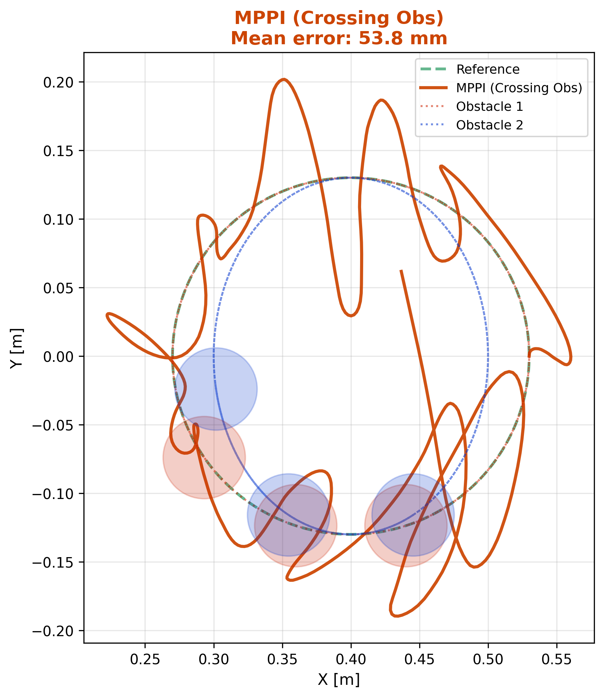
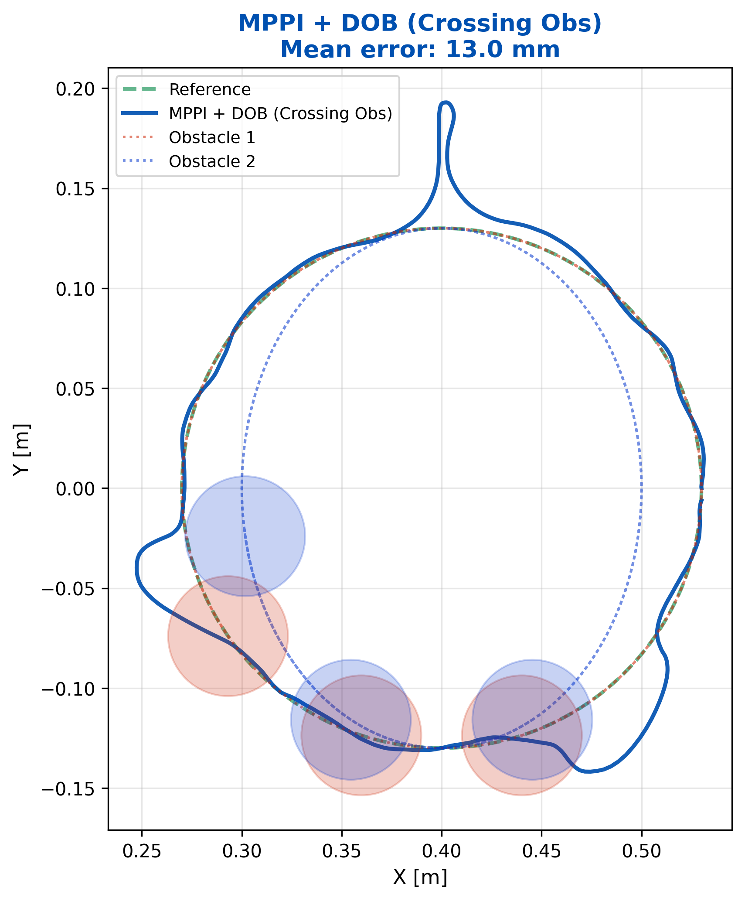
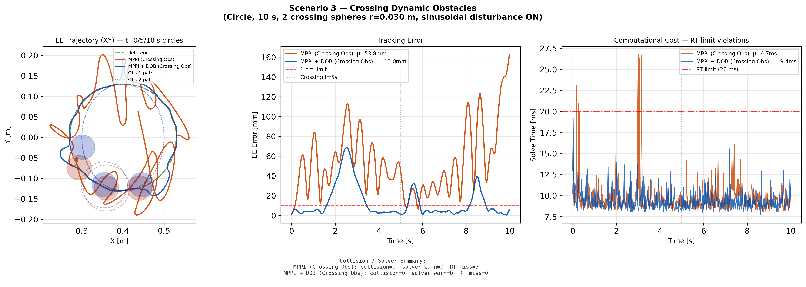
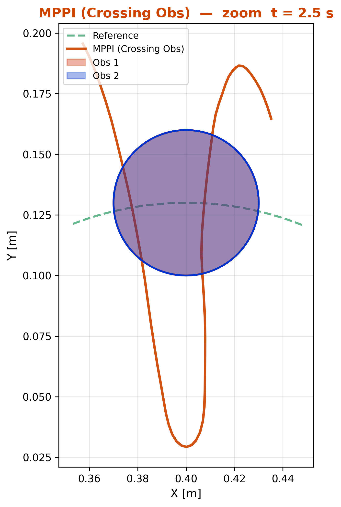
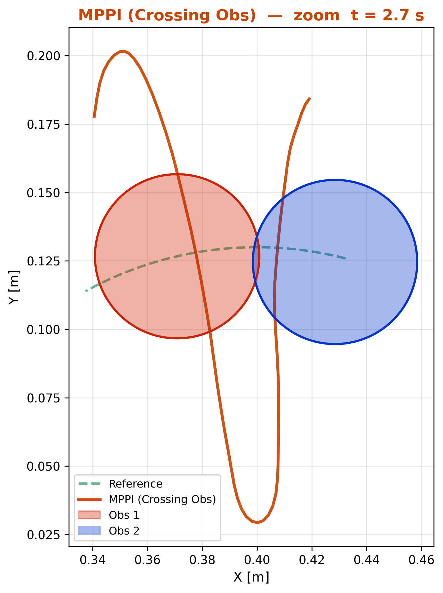
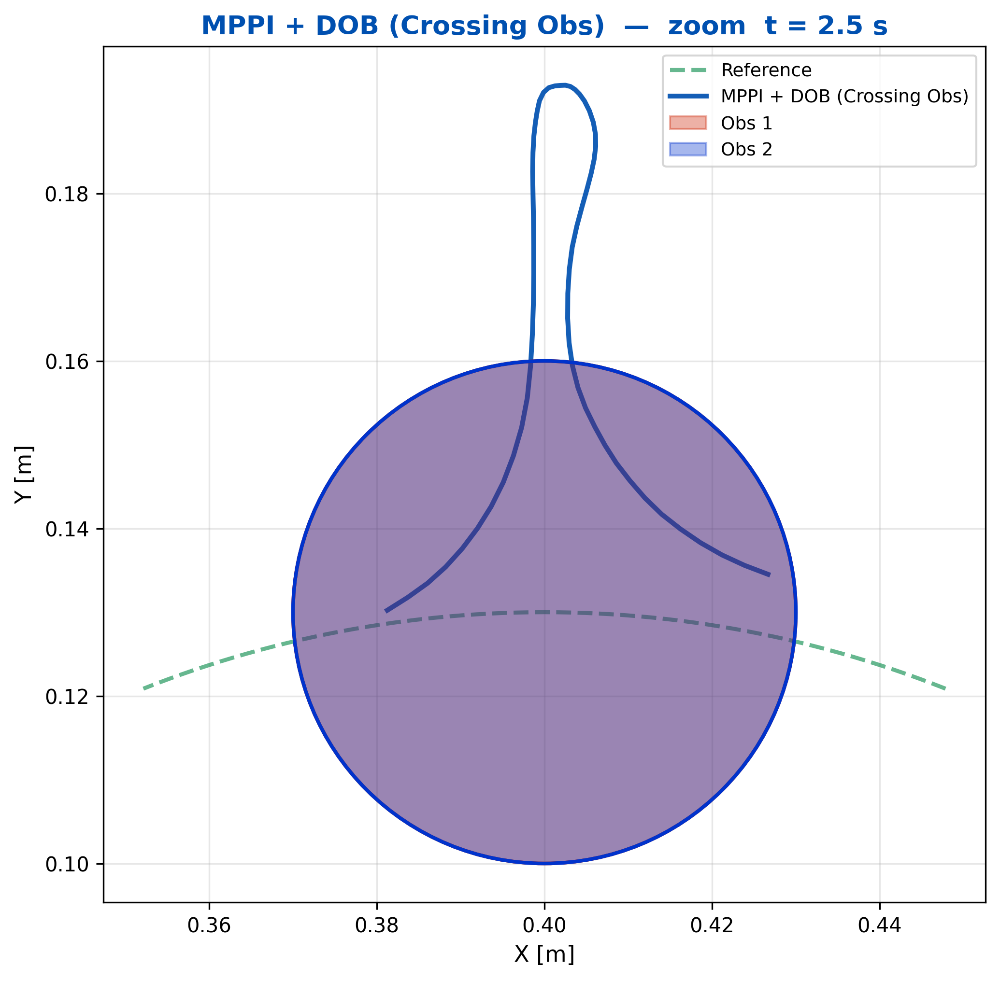
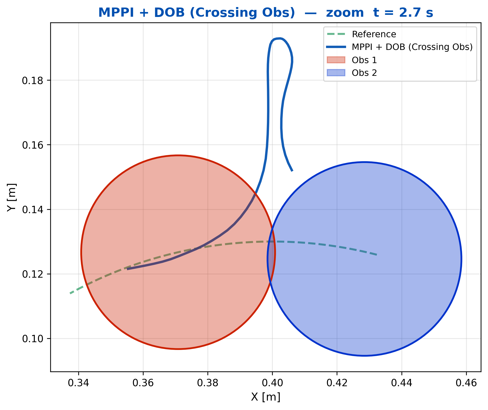

# robust-mppi-dob

[](https://www.python.org/)
[](https://pytorch.org/)
[](https://docs.acados.org/)

6-DOF UR5 매니퓰레이터의 **MPPI + Disturbance Observer** 강인 궤적 추종 제어기.  
외란 및 동적 장애물 환경에서 SQP(acados) 계열과 비교 실험한 시뮬레이션 코드.

---

## 시뮬레이션 결과 (Results)

### DOB 효과: MPPI vs MPPI+DOB

외란(최대 15 Nm 사인파)과 교차 동적 장애물이 동시에 존재하는 환경에서의 실험입니다.  
DOB 없이는 외란에 의해 궤적이 크게 흔들리지만, DOB를 추가하면 훨씬 안정적으로 목표 궤적을 따라갑니다.

| MPPI (DOB 없음) | MPPI + DOB |
|:---:|:---:|
|  |  |
| 외란에 의해 엔드이펙터 궤적이 크게 흔들림 | DOB가 외란을 실시간 추정·보상 → 깔끔한 원형 추종 |

---

### 나란히 비교 (Side-by-Side)

두 컨트롤러를 같은 화면에서 직접 비교한 결과입니다.  
왼쪽(주황색)은 DOB 없는 MPPI, 오른쪽(파란색)은 MPPI+DOB입니다.  
아래 패널의 추적 오차 그래프에서 DOB 유무의 차이가 확연하게 나타납니다.



> **핵심 수치**  
> - MPPI (no DOB): 평균 추적 오차 μ ≈ **59.3 mm**  
> - MPPI + DOB:   평균 추적 오차 μ ≈ **12.0 mm** (약 5× 개선)

---

### 장애물 회피 구간 확대 (Zoom)

동적 장애물이 교차하는 순간(t ≈ 2.5 s, t ≈ 2.7 s)을 확대한 그림입니다.  
MPPI+DOB는 장애물을 부드럽게 회피하면서도 목표 궤적으로 빠르게 복귀합니다.

| t ≈ 2.5 s | t ≈ 2.7 s |
|:---:|:---:|
|  |  |
| MPPI — 장애물 접근 시 궤적 요동 | MPPI — 이후에도 오차 지속 |

| t ≈ 2.5 s | t ≈ 2.7 s |
|:---:|:---:|
|  |  |
| MPPI+DOB — 장애물 회피하면서 궤적 유지 | MPPI+DOB — 빠른 복귀, 낮은 오차 |

---

## 파일 구조

```
├── disturbance_observer.py    # 통합 DOB 모듈 — numpy / torch 공용 (α=40 rad/s)
│
├── mppi_dob_controller.py     # MPPI + DOB  (PyTorch, GPU)
├── sqp_controller.py          # SQP + DOB  (acados, Full SQP max_iter=15)
├── sqp_soft_controller.py     # SQP + Soft Constraint + DOB  (acados)
├── sqp_cross_controller.py    # SQP + DOB, 교차 동적 장애물 전용  (acados)
│
├── run_comparison.py          # 컨트롤러 비교 실행 메인
│
└── paper_figures/             # 실험 결과 그림
```

---

## 실행 방법

```bash
# 교차 동적 장애물 시나리오 (메인 실험)
python run_comparison.py cross

# 기타 모드
python run_comparison.py base        # 장애물 없음
python run_comparison.py obstacle    # 정적 장애물
python run_comparison.py mppi_cross  # MPPI vs MPPI+DOB 집중 비교 (논문 그림)
python run_comparison.py cross_nodob # DOB 유무 효과 비교
```

결과 `.npz`가 이미 있으면 재실행 없이 로드. 재실행하려면 해당 `.npz` 삭제 후 실행.

---

## 의존성

```bash
pip install -r requirements.txt
# acados: https://docs.acados.org/installation/
# pytorch_mppi: https://github.com/UM-ARM-Lab/pytorch_mppi
```

---

## 시뮬레이션 환경

| 항목 | 설정 |
|:--|:--|
| Robot | UR5 6-DOF |
| 궤적 | Circle (r=0.13 m, 10 s) |
| 외란 | 사인파, 최대 15 Nm |
| 장애물 | 교차 동적 구체 ×2 |
| MPPI H / K | 12 / 2,000 |
| SQP Horizon | 25 |
| dt | 0.02 s |
